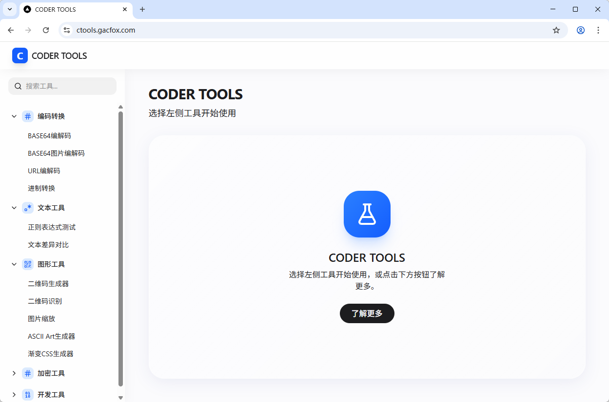

# Code Tools 开发者小工具网站

Code Tools是一个为开发者设计的在线工具网站。

[](https://vercel.com/new/clone?repository-url=https%3A%2F%2Fgithub.com%2Fgacfox%2Fcoder-tools)

## 功能特性



### 编解码转换工具

* BASE64文本编解码
* BASE64图片编解码
* URL编解码
* 进制转换
* Unicode转义

### 文本工具

* 正则表达式测试
* 文本差异对比

### 图形工具

* 二维码生成器
* 二维码识别
* 图片缩放
* ASCII Art生成器
* 渐变CSS生成器

### 加密工具

* HASH计算
* 强随机密码生成器

### 开发工具

* Unix时间戳转换
* User-Agent分析
* UUIDv4生成器
* SQL格式化工具
* JWT解析

### 审查工具

* 随机代码生成器

## 开发环境搭建

1. 安装 Node.js (v22.0.0 或更高版本)
2. 安装项目依赖:
   ```bash
   npm install
   ```
3. 启动开发服务器:
   ```bash
   npm run dev
   ```
4. 访问 http://localhost:3000

## 部署

项目可以部署到任何支持 Next.js 的平台，如 Vercel、Netlify 等。

**免责声明**: 这个代码仓库完全由AI生成，旨在体验Vibe Coding模式，可能存在Bug，内容请仔细甄别。
